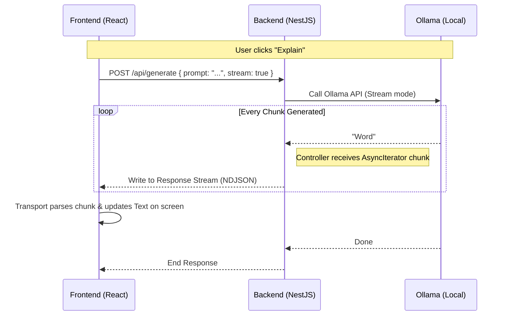
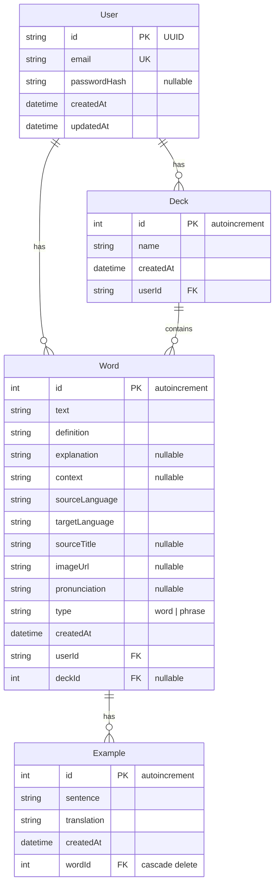

# High-Level Architecture: The "Self-Hosted Cloud"

This project is architected as a **Personal Cloud Platform**. It is designed to run entirely on the user's local machine (or a private server) while offering a cloud-like experience (API persistence, AI services) to the frontend.

## 🏗️ System Overview

```mermaid
graph TD
    subgraph "Frontend Layer (Browser)"
        UI["React Client (Web App)"]
        Ext["Chrome Extension (Side Panel)"]
    end

    subgraph "Secure Gateway (Docker Host)"
        Caddy["Caddy (Rev Proxy + TLS)"]
    end

    subgraph "Backend Layer (NestJS)"
        API["API Gateway (Port 3000)"]
        Auth[Auth Guard (JWT)]
        Proxy[AI Proxy Service]
        Words[Words/Decks Service]
    end

    subgraph "Infrastructure Layer"
        DB[(PostgreSQL)]
        Ollama[[Ollama AI Engine]]
        Anki[[Anki (AnkiConnect)]]
    end

    UI -->|HTTPS/WSS| Caddy
    Ext -->|HTTPS/WSS| Caddy
    Caddy -->|Reverse Proxy| API
    
    API -->|Read/Write| DB
    API --> Auth
    API -->|Stream| Proxy
    API --> Words
    
    Proxy -->|Generate/Translate/Analyze| Ollama
    UI -->|AnkiConnect API| Anki
```



## 🧩 Components

### 1. Monorepo Structure

We use **NPM Workspaces** to manage multiple applications in a single repository.

- `apps/client`: The Frontend application (Vite + React 19).
- `apps/server`: The Backend API (NestJS 11).

### 2. Apps

#### **Client (`@reader-helper/client`)**

- **Unexpected Design**: It thinks it's talking to a real cloud API, but it's just `localhost:3000`.
- **Tech**: React 19, Tailwind, Zustand, Framer Motion, Radix UI, PDF.js, EPUB.js.
- **Responsibility**: User Interface, Text Tokenization, Audio Playback, Gamified Learning, Chrome Extension.

#### **Server (`@reader-helper/server`)**

- **The Brain**: Centralizes logic that requires persistence or heavy compute access.
- **Tech**: NestJS 11, Prisma ORM, Express, JWT.
- **Responsibility**:
  - **Persistence**: Saves Words, Examples, Decks, and Users to Postgres.
  - **AI Proxying**: Hides the complexity of Ollama. Manages generation, translation, grammar analysis, and writing feedback. Streams responses back to the client.
  - **Authentication**: JWT-based auth with registration, login, and route guards.
  - **CORS**: Handles security policies for the frontend.

### 3. Data & AI

#### **PostgreSQL**

- **Role**: Primary Source of Truth.
- **Access**: Through Prisma ORM only.
- **Schema**: Users, Words (with type: word/phrase), Examples (cascade delete), Decks.

#### **Ollama**

- **Role**: The Intelligence Engine.
- **Services**: Generation, Translation, Grammar Analysis, Writing Feedback, Game Content.
- **Access**: Hidden behind the NestJS Proxy. The frontend *never* talks to Ollama directly. This allows us to swap Ollama for OpenAI/Anthropic in the future without updating the client.

#### **Anki (Optional)**

- **Role**: External vocabulary source for learning games.
- **Access**: Direct from the client via AnkiConnect (localhost:8765). Uses `text/plain` content-type headers for CORS compatibility.

---

## 🎯 Feature Architecture

### Client Feature Modules (`apps/client/src/presentation/features/`)

| Module | Description |
| :--- | :--- |
| **reader/** | Core reading engine -- tokenization, grammar mode, rich translation, sentence navigation, saved words panel |
| **learning-mode/** | Gamified training arena -- 5 game types (multiple choice, word builder, audio dictation, sentence scramble, story), 3 data sources (DB, Anki, AI), progression system |
| **word-manager/** | Vocabulary CRUD -- dual word/phrase tabs, AI example generation, CSV/Anki export |
| **interactive-writing/** | Writing assistant -- real-time grammar/spelling/punctuation/fluency corrections with smart offset tracking |
| **importer/** | Content import -- PDF and EPUB file processing with preview |
| **controls/** | Reader control panel -- language selection, mode switching, settings |
| **settings/** | App preferences -- themes, fonts, proficiency levels, model selection |
| **auth/** | Authentication -- registration, login flows |
| **navigation/** | View routing -- 4 main views (Reader, Word Manager, Learning Mode, Writing) |

### Client Infrastructure (`apps/client/src/infrastructure/`)

| Module | Description |
| :--- | :--- |
| **api/** | HTTP clients -- Ollama proxy, words CRUD, auth endpoints, base URL resolution |
| **audio/** | Web Speech API integration -- TTS with karaoke sync, smart resume |
| **auth/** | JWT token management, extension auth support |
| **ai/** | AI service abstraction layer (server vs mock) |
| **data/** | Local storage persistence |
| **settings/** | Theme/font/preference management with Zustand store |

### Server Modules (`apps/server/src/`)

| Module | Description |
| :--- | :--- |
| **auth/** | JWT authentication -- register, login, profile, guards, public decorator |
| **words/** | Word/Deck CRUD -- paginated queries, language filtering, example generation |
| **ollama/** | AI proxy -- 5 specialized services (generation, translation, grammar, writing, client) |
| **prisma/** | Database connection and ORM service |

---

## 🔌 API Endpoints

### Authentication

| Method | Path | Description |
| :--- | :--- | :--- |
| POST | `/api/auth/register` | User registration |
| POST | `/api/auth/login` | User login |
| GET | `/api/auth/me` | Get current user profile |

### Words

| Method | Path | Description |
| :--- | :--- | :--- |
| GET | `/api/words` | List words (paginated, filterable by language/type) |
| GET | `/api/words/:id` | Get single word with examples |
| POST | `/api/words` | Create word/phrase |
| PATCH | `/api/words/:id` | Update word/phrase |
| DELETE | `/api/words/:id` | Delete word (cascade deletes examples) |
| GET | `/api/words/languages` | Get available language pairs |

### AI / Ollama

| Method | Path | Description |
| :--- | :--- | :--- |
| POST | `/api/chat` | Chat with LLM (streaming) |
| POST | `/api/generate` | Text generation (streaming) |
| GET | `/api/tags` | List available Ollama models |
| POST | `/api/generate-examples` | Generate example sentences |
| POST | `/api/analyze-grammar` | Full grammar analysis |
| POST | `/api/translate` | Context-aware translation |
| POST | `/api/explain` | Text explanation |
| POST | `/api/rich-translation` | Enhanced translation with breakdowns |
| POST | `/api/generate-content` | Generate structured learning content |
| POST | `/api/generate-game-content` | Generate game-specific content |
| POST | `/api/check-writing` | Writing analysis (minimal/full mode) |

---

## 🗄️ Database Schema


